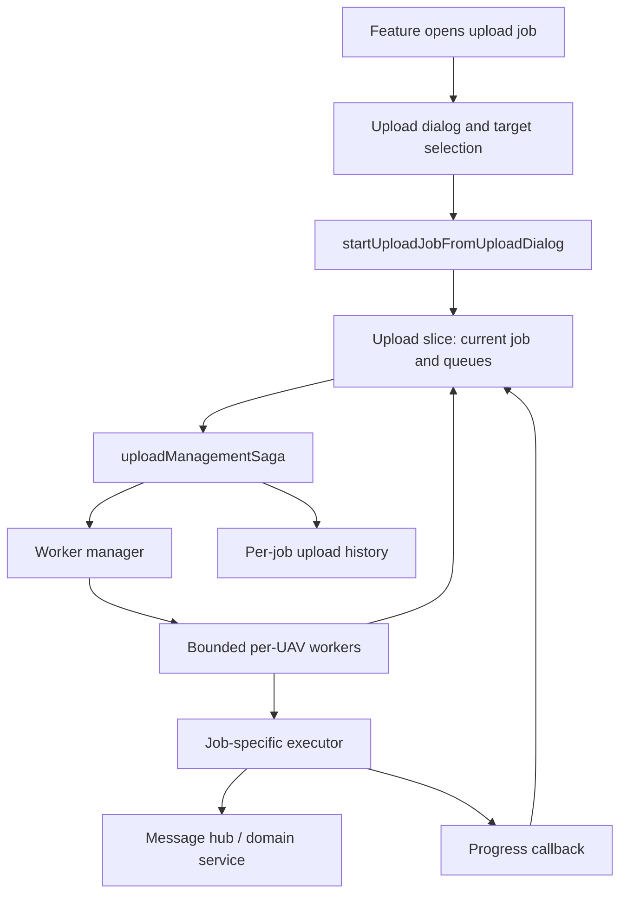

# Upload jobs

## Purpose

`src/features/upload/` is the shared framework for long-running, fan-out operations on UAVs. Despite its name, it is not limited to transferring show data: show, parameter, firmware, and mission-item uploads are job types using the same scheduling, per-UAV status, progress, retry, cancellation, and history model. The name is a historical misnomer retained for backward compatibility. Use `features/tasks` for independently tracked single-UAV operations; upload jobs own the lifecycle of a coordinated multi-UAV run.

## Architecture at a glance

A caller opens the dialog with a typed-by-convention `{ type, payload }` job (`openUploadDialogForJob` in `slice.ts`). `startUploadJobFromUploadDialog` in `actions.ts` resolves the targets, snapshots the chosen job and queue into `currentJob`, and emits `startUpload`. `uploadManagementSaga` in `saga.ts` looks up the job specification and runs its worker manager until it completes or `cancelUpload` wins the race.

The specification registry in `jobs.ts` is the seam between domain features and this generic engine. Startup registers built-in specifications in `src/upload-jobs.js` before the root saga starts. Each specification owns domain semantics and one-UAV execution; the upload feature owns orchestration and shared presentation state.

## Job contract

`JobSpecification` in `jobs.ts` identifies a job type and describes its scope, optional per-UAV `selector`, required `executor`, and optional `workerManager`.

- **Payload** is created by the initiating feature and is shared by all targeted UAVs. Its shape belongs exclusively to that job type.
- **Selector** is a per-UAV state demultiplexer. The worker evaluates it immediately before execution, so it can derive data such as one drone's show configuration from current Redux state. A selector error is a permanent failure: it is reported but never auto-retried.
- **Executor** performs work for exactly one UAV and receives its ID, the shared payload, per-UAV selector data, and an `onProgress` callback. Rejections are normal per-UAV failures and are eligible for automatic retry.
- **Scope** controls eligible dialog targets: all known UAVs, firmware-compatible objects, the mission mapping, or the single selected UAV. Global-selection restriction is applied to the relevant scope.
- **Worker manager** controls the job-wide scheduling strategy. The default manager is appropriate for normal jobs, but a custom manager is a supported extension point when a job genuinely needs a different top-level execution policy.

The current built-ins show the split: show uploads use a selector to construct per-UAV configuration and mission scope; firmware uses compatible scope; mission items use the selected UAV; parameter uploads use the default all-UAV scope while their executor filters shared items itself.

## Default long-running-job lifecycle

`forkingWorkerManagementSaga` creates the configured maximum number of workers and feeds them through a one-item buffered channel. Redux queues are the authoritative visible lifecycle:

`waiting → queued → in progress → finished | failed`

Workers move entries between these states around the selector and executor. `queued` and `in progress` items are no longer user-editable. A worker failure records a per-UAV error; a selector failure is deliberately excluded from the session retry list to avoid an infinite retry loop. The manager may re-enqueue only failures from the current run when auto-retry is enabled, and waits briefly for active workers before declaring the run complete. It can also flash failed UAVs after scheduling is exhausted.

Progress reports enter a fixed-size-one saga channel before updating Redux. This intentionally collapses stale intermediate updates, retaining only the newest report under load. Per-UAV progress is normalized to `0..1`; completed UAVs are forced to `1` so completion-time estimation remains meaningful.

A completed run writes a compacted, per-job history entry, then clears active queues and transient errors/progress. History preserves the final per-UAV successes, failures, and error messages; selectors layer active queues over history for status displays. Only upload settings persist across reloads (`src/store/index.js`); active jobs, queues, and history are session state.

## Cancellation and concurrency invariants

Only one upload job can run at a time. The dialog blocks a different job type until the active job finishes or is cancelled; `setupNextUploadJob` refuses to replace a running job.

Cancellation is cooperative. The `cancelUpload` race cancels the worker-manager task and its workers, so executors **must** either return a Redux-Saga-cancellable promise (for example, a promise with `CANCEL`) or be an executor saga that responds to cancellation. Do not assume cancellation interrupts arbitrary asynchronous work.

UAVs still waiting when cancellation occurs deliberately remain in the waiting queue; this permits a later retry. External code may dispatch the queue-management actions to remove them when that is the correct domain decision. The run itself is recorded as cancelled and active queue state is then cleared into history.

Do not dispatch underscore-prefixed lifecycle actions outside `saga.ts`; they encode queue transitions and history consistency. Do not mutate queues while an item is `queued` or `in progress`. Do not register duplicate job types; registry registration fails fast and is disposed during hot-module cleanup.

## Extension points and deliberate gaps

To add a normal job, create a domain-owned specification with a stable unique type, scope, executor, and (only when per-UAV state is needed) selector; add it to `src/upload-jobs.js`. Initiate it with `openUploadDialogForJob`, supplying the job-specific payload. Prefer the default worker manager; implement a custom one only for a materially different scheduling policy, while preserving the upload slice lifecycle expected by shared UI.

The framework does not currently model job results beyond success/failure and per-UAV error history. It is intentionally expected to gain **result pieces** returned by individual UAV executions and an aggregated job result; do not infer or create this API from the current `Promise<void>` executor contract. Result aggregation design remains open.

No active upload state is recovered after reload, and there is no forced cancellation mechanism for executors that ignore saga cancellation.
